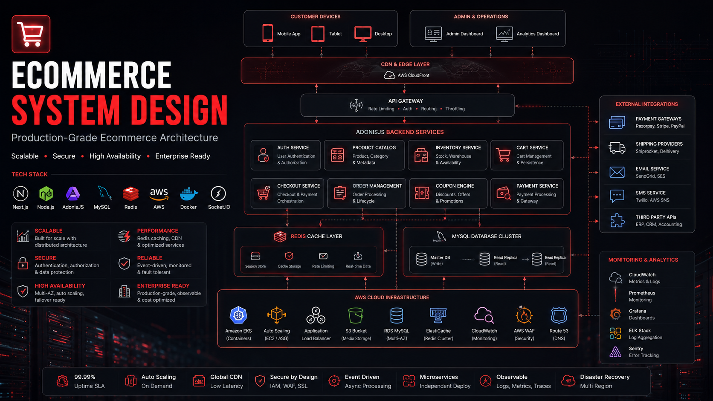
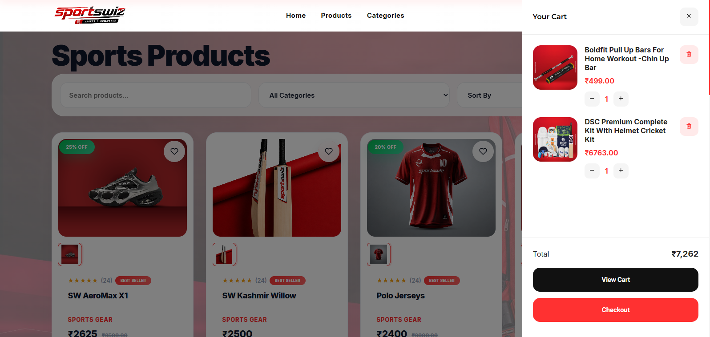
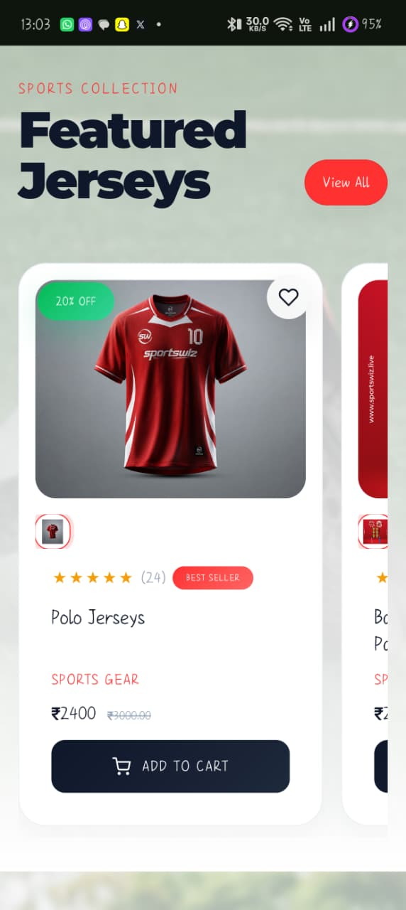
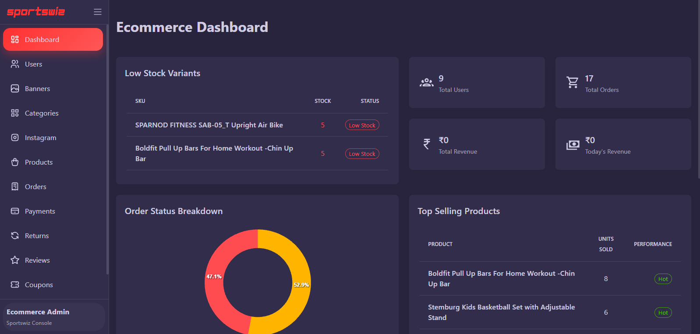

# 🛒 Ecommerce System Design

> Production-Grade Ecommerce Architecture Case Study



A senior-level system design and backend architecture repository demonstrating how a modern ecommerce platform can be designed, scaled, secured, and operated in production.

This repository is inspired by real-world ecommerce engineering challenges and focuses on architecture, scalability, reliability, security, and operational excellence.

> Note:
> This repository does not contain any proprietary company code.
> All content is architecture-focused and intended for educational, portfolio, and system design showcase purposes.

---

## 👨‍💻 My Role

**Senior Backend Engineer / Full Stack Engineer**

Key responsibilities covered in this case study:

- Ecommerce System Architecture
- Product Catalog Design
- Inventory Management
- Cart & Checkout Systems
- Order Management
- Coupon & Promotion Engine
- Authentication & Authorization
- Redis Caching Strategy
- Database Design
- AWS Infrastructure
- Performance Optimization
- Scalability Engineering
- Security Architecture
- Monitoring & Observability
- Disaster Recovery Planning

---

## 🏗️ Technology Stack

### Frontend

- Next.js
- React.js

### Backend

- Node.js
- AdonisJS

### Database

- MySQL

### Caching

- Redis

### Infrastructure

- AWS
- Docker

### Realtime

- Socket.IO

---

# 📚 Repository Structure

```text
docs/
├── architecture/
├── database/
├── infrastructure/
├── security/
├── engineering/
├── challenges/
└── screenshots/

diagrams/
├── system-architecture.mmd
├── product-catalog-flow.mmd
├── cart-flow.mmd
├── checkout-flow.mmd
├── order-management.mmd
├── inventory-flow.mmd
├── coupon-engine.mmd
├── authentication-flow.mmd
├── redis-architecture.mmd
├── deployment-flow.mmd
└── disaster-recovery.mmd

assets/
├── architecture.png
├── storefront.png
├── product-page.png
├── checkout.png
├── admin-dashboard.png
└── mobile-app.png
```

---

# 🎯 Architecture Coverage

This repository covers:

### Ecommerce Architecture

- System Overview
- Service Boundaries
- Domain Modeling
- Scalability Strategy

### Product Catalog

- Product Architecture
- Categories
- Variants
- Search & Filtering

### Inventory

- Inventory Tracking
- Reservation Model
- Oversell Prevention
- Stock Synchronization

### Cart & Checkout

- Guest Cart
- User Cart
- Cart Synchronization
- Checkout Scalability

### Order Management

- Order Lifecycle
- Fulfillment Workflow
- Returns & Refunds

### Promotions

- Coupon Engine
- Abuse Prevention
- Eligibility Rules

### Security

- Authentication
- Authorization
- Payment Security
- Rate Limiting

### Infrastructure

- AWS Architecture
- Deployment Pipeline
- Monitoring
- Disaster Recovery

### Engineering

- Architecture Decisions
- Production Incidents
- Lessons Learned

---

# 🧠 Key Engineering Challenges

The repository includes deep dives into real-world ecommerce challenges:

| Challenge | Focus |
|------------|---------|
| Inventory Consistency | Preventing overselling |
| Checkout Scalability | High traffic checkout flows |
| Coupon Abuse | Fraud prevention |
| Cart Synchronization | Multi-device consistency |
| Cache Invalidation | Redis consistency challenges |

---

# 🗄️ Database Design

Topics covered:

- Relational Modeling
- Product Catalog Schema
- Variant Architecture
- Order Snapshots
- Address Snapshots
- Indexing Strategy
- Query Optimization
- Database Scaling

---

# ⚡ Redis Strategy

Redis usage includes:

- Product Cache
- Category Cache
- Inventory Cache
- Session Store
- Cart Cache
- Coupon Cache
- Rate Limiting
- Background Jobs

Topics covered:

- Cache Aside Pattern
- Cache Invalidation
- Event-Driven Updates
- Cache Stampede Prevention

---

# ☁️ AWS Infrastructure

The infrastructure section covers:

- CloudFront CDN
- Application Load Balancer
- EC2 Containers
- S3 Storage
- RDS MySQL
- Redis
- Monitoring
- Backup Strategy
- Disaster Recovery

---

# 🔐 Security Architecture

Topics covered:

### Authentication

- JWT Authentication
- Session Management
- Password Reset Flow

### Authorization

- RBAC
- Permission Management
- Admin Access Control

### Infrastructure Security

- Rate Limiting
- Secrets Management
- Logging & Auditing

### Payment Security

- Server-Side Validation
- Fraud Prevention
- Transaction Integrity

---

# 📈 Scalability Design

The architecture is designed around:

- Horizontal Scaling
- Stateless Applications
- Read Replicas
- Redis Caching
- CDN Distribution
- Queue-Based Processing
- Database Optimization
- Operational Monitoring

---

# 📊 Monitoring & Observability

Monitoring areas include:

- API Performance
- Checkout Success Rate
- Inventory Metrics
- Payment Metrics
- Cache Metrics
- Error Tracking
- Infrastructure Health

---

# 🚨 Production Engineering

Dedicated sections cover:

### Production Incidents

- Checkout Failures
- Redis Outages
- Inventory Issues
- Payment Gateway Problems

### Lessons Learned

- Architecture Lessons
- Database Lessons
- Security Lessons
- Scaling Lessons
- Operational Lessons

---

# 📷 Platform Showcase

Repository includes architecture documentation for:

### Storefront


- Homepage
- Product Discovery
- Search & Filtering

### Product Details


- Product Gallery
- Variant Selection
- Inventory Visibility

### Checkout



- Address Management
- Payment Workflow
- Order Review

### Customer Dashboard



- Orders
- Addresses
- Wishlist
- Profile

### Admin Platform



- Product Management
- Inventory Management
- Order Operations
- Reporting

---

# 🎨 Architecture Diagrams

Included Mermaid diagrams:

- System Architecture
- Product Catalog Flow
- Cart Flow
- Checkout Flow
- Order Management
- Inventory Flow
- Coupon Engine
- Authentication Flow
- Redis Architecture
- Deployment Flow
- Disaster Recovery

---

# 🎯 What This Repository Demonstrates

### Backend Engineering

- API Design
- Data Modeling
- Distributed Systems

### System Design

- Scalability
- Reliability
- Availability

### Cloud Engineering

- AWS Architecture
- Deployment Strategy
- Recovery Planning

### Security Engineering

- Authentication
- Authorization
- Infrastructure Security

### Operational Excellence

- Monitoring
- Incident Response
- Capacity Planning

---

# 🚀 Intended Audience

This repository is useful for:

- Engineering Managers
- Hiring Managers
- Technical Recruiters
- Senior Backend Engineers
- Full Stack Engineers
- System Design Interview Preparation
- Architecture Discussions

---

# 📝 Disclaimer

This repository is a system design and architecture showcase.

It does not contain:

- Proprietary business logic
- Company source code
- Internal implementation details
- Confidential information

All content has been created for educational, portfolio, and architectural demonstration purposes.

---

# ⭐ Highlights

- Production-Grade Ecommerce Architecture
- Senior Backend Engineering Perspective
- Real-World Scalability Challenges
- AWS Infrastructure Design
- Security & Reliability Focus
- Detailed Engineering Documentation
- System Design Portfolio Project

---

## Author

**Amar Dutt Upadhyay**

Senior Backend Engineer | Full Stack Engineer

Core Technologies:

Node.js • AdonisJS • NestJS • Next.js • React.js • MySQL • Redis • AWS • Docker • Socket.IO

---

If you found this repository useful, consider starring it and connecting for architecture and backend engineering discussions.