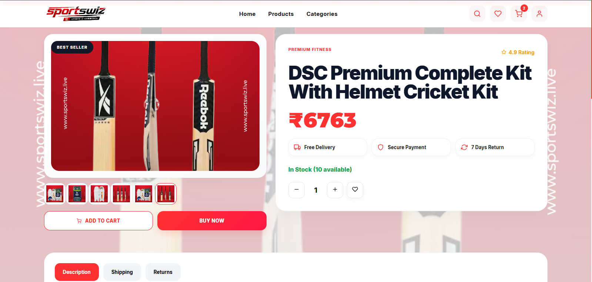

# Product Details Experience

## Overview

The Product Details Page (PDP) is one of the highest-impact pages in an ecommerce platform.

Customers make purchasing decisions here.

The product page bridges the gap between:

```text id="a1p4xr"
Product Discovery
        ↓
Purchase Intent
        ↓
Checkout
```

Because of this, the PDP must balance:

* Product information
* Performance
* Trust signals
* Inventory visibility
* Mobile usability
* Conversion optimization

The product page architecture was designed to maximize conversion while maintaining performance and scalability.

---

# Business Objectives

The product page must:

### Inform Customers

Provide accurate product information.

---

### Build Confidence

Reduce uncertainty before purchase.

---

### Increase Conversion

Encourage cart additions and purchases.

---

### Support Scalability

Handle large catalogs and traffic spikes.

---

# Product Page Architecture

```text id="b7m2qn"
Product URL
     ↓
Product API
     ↓
Variant Data
     ↓
Inventory Data
     ↓
Rendered Product Page
```

---

# Core Components

Typical PDP sections:

```text id="c9n5wp"
Image Gallery

Product Information

Variant Selector

Price Information

Actions

Related Products
```

---

# Product Gallery

The gallery is often the first element customers engage with.

---

## Purpose

Showcase the product visually.

---

## Typical Elements

```text id="d4m8rv"
Primary Image

Thumbnail Gallery

Zoom Support
```

---

# Image Architecture

Images are delivered through:

```text id="e7n3qa"
CDN

Optimized Formats

Responsive Sizes
```

---

## Benefits

* Faster loading
* Better mobile performance
* Lower bandwidth consumption

---

# Product Information Section

Displays:

```text id="f2m6wx"
Name

Description

Brand

Category
```

---

## Goals

Help customers evaluate products quickly.

---

# Pricing Section

Displays:

```text id="g5n9rv"
Current Price

Discount

Savings
```

---

## Engineering Considerations

Pricing must always reflect current backend data.

---

# Variant Architecture

Many products have variations.

---

## Examples

```text id="h8m2qa"
Size

Color

Material
```

---

# Variant Selection Flow

```text id="i3n7wx"
Product Loaded
       ↓
Default Variant Selected
       ↓
Customer Changes Variant
       ↓
Page Updates
```

---

# Variant-Specific Data

Changing variants may update:

```text id="j6m4rv"
Price

Inventory

Images

SKU
```

---

## Benefits

Accurate purchasing information.

---

# Inventory Awareness

Customers should know availability.

---

## Examples

```text id="k1n8qa"
In Stock

Low Stock

Out Of Stock
```

---

## Benefits

Improves purchasing decisions.

---

# Inventory Validation

Inventory is validated:

```text id="l4m3wx"
During Product View

During Checkout
```

---

## Reason

Inventory changes continuously.

---

# Add To Cart Experience

One of the most important PDP actions.

---

## Flow

```text id="m7n6rv"
Select Variant
      ↓
Select Quantity
      ↓
Add To Cart
```

---

## Goals

Provide immediate feedback.

---

# Buy Now Experience

Supports direct checkout.

---

## Flow

```text id="n2m9qa"
Select Variant
      ↓
Buy Now
      ↓
Checkout
```

---

## Benefits

Reduced purchasing friction.

---

# Wishlist Integration

Customers often research before purchasing.

---

## Flow

```text id="o5n4wx"
Product
     ↓
Add To Wishlist
```

---

## Benefits

Supports:

```text id="p8m7rv"
Retention

Repeat Visits
```

---

# Product Description

Detailed product information improves trust.

---

## Examples

```text id="q3n2qa"
Features

Specifications

Materials
```

---

# Related Products

Supports product discovery.

---

## Typical Sources

```text id="r6m5wx"
Same Category

Similar Products

Popular Products
```

---

## Benefits

Increases:

```text id="s9n8rv"
Session Duration

Average Order Value
```

---

# Mobile Experience

Most ecommerce traffic is mobile-first.

---

## Design Priorities

```text id="t4m3qa"
Fast Loading

Touch Friendly

Easy Navigation
```

---

# Mobile Purchase Bar

Common mobile pattern:

```text id="u7n6wx"
Add To Cart

Buy Now
```

Persistent at the bottom of the screen.

---

## Benefits

Improved conversion.

---

# Performance Considerations

Product pages are heavily trafficked.

---

## Optimization Areas

```text id="v2m9rv"
Image Loading

Caching

API Optimization
```

---

# SEO Considerations

Product pages drive organic traffic.

---

## Requirements

```text id="w5n4qa"
Metadata

Product URLs

Structured Data
```

---

# Analytics Events

Track:

```text id="x8m7wx"
Product View

Variant Change

Add To Cart

Buy Now
```

---

## Benefits

Supports conversion optimization.

---

# Security Considerations

Protect:

```text id="y3n2rv"
Pricing

Inventory

Cart Actions
```

---

## Principle

All critical validations occur server-side.

---

# Failure Scenario #1

## Outdated Inventory

Impact:

Customer frustration.

---

## Resolution

Inventory validation at checkout.

---

# Failure Scenario #2

## Broken Product Images

Impact:

Reduced trust.

---

## Resolution

Image monitoring and fallbacks.

---

# Failure Scenario #3

## Variant Mismatch

Impact:

Incorrect purchases.

---

## Resolution

Variant-level validation.

---

# Failure Scenario #4

## Slow Product Loading

Impact:

Conversion decline.

---

## Resolution

Caching and CDN optimization.

---

# Production Lessons Learned

## Lesson 1

High-quality product imagery significantly influences conversion.

---

## Lesson 2

Inventory visibility reduces customer uncertainty.

---

## Lesson 3

Mobile purchase flows require dedicated optimization.

---

## Lesson 4

Variant architecture becomes increasingly important as catalogs grow.

---

## Lesson 5

Every second of latency impacts conversion rates.

---

# Recruiter & Portfolio Notes

This product page architecture demonstrates experience with:

### Ecommerce Engineering

* Product catalog systems
* Variant modeling
* Inventory integration

---

### Frontend Architecture

* Dynamic product rendering
* Responsive design
* Conversion-focused UX

---

### Backend Integration

* Product APIs
* Inventory APIs
* Cart APIs

---

### Performance Engineering

* Image optimization
* Caching strategies
* SEO optimization

---

# Screenshot Placeholder

Product page reference image:



Recommended capture areas:

```text id="a2n8wx"
Image Gallery

Variant Selector

Pricing Section

Inventory Status

Mobile Purchase Bar
```

---

# Engineering Outcomes

The product details architecture provides:

* Accurate product information
* Variant-aware purchasing
* Inventory visibility
* Strong mobile experience
* Better conversion support
* Scalable catalog integration
* Performance optimization
* Production-grade ecommerce purchasing experience

The product page serves as the most important conversion-focused experience in the ecommerce platform and demonstrates how catalog architecture, inventory systems, frontend engineering, and user experience design combine to drive successful purchasing outcomes.
